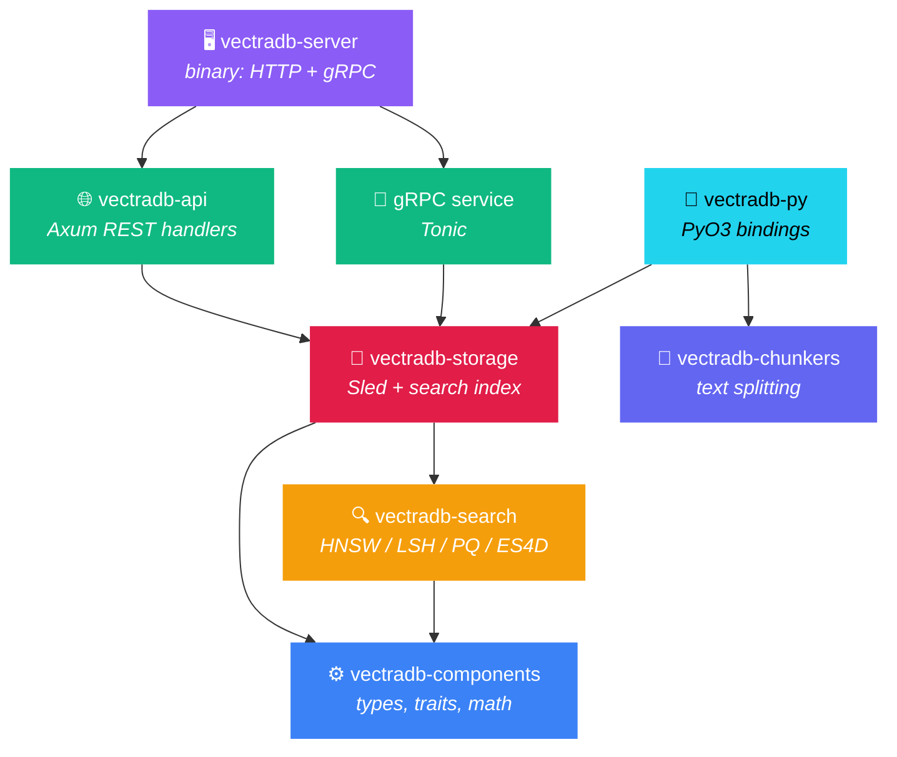
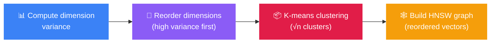

<h1 align="center">🏗️ Architecture</h1>

<p align="center">
  How VectraDB is structured, how data flows, and how the components interact.
</p>

---

## 📦 Crate Map

VectraDB is a Rust workspace with 7 crates. Each crate has a single responsibility:



---

## ⚙️ vectradb-components

> The foundation crate. Everything else depends on it.

**Key types:**

| Type | Purpose |
|------|---------|
| `VectorDocument` | A vector + metadata (ID, dimension, timestamps, tags) |
| `SimilarityResult` | Search result (ID, score, metadata) |
| `DatabaseStats` | Stats (total vectors, dimension, memory) |
| `VectraDBError` | Error enum: `DimensionMismatch`, `VectorNotFound`, `DuplicateVector`, `InvalidVector`, `DatabaseError` |

**Key traits:**

| Trait | Methods | Implemented By |
|-------|---------|----------------|
| `VectorDatabase` | create, get, update, delete, upsert, search, list, stats | `InMemoryVectorDB`, `PersistentVectorDB` |

**Modules:**
- `similarity` — cosine, Euclidean, Manhattan, dot product
- `vector_operations` — create, update, validate, normalize
- `indexing` — LinearIndex, HashIndex (simple in-memory)
- `storage` — InMemoryVectorDB (HashMap-based)

---

## 🔍 vectradb-search

> Search algorithm implementations. Each implements `AdvancedSearch`.

```rust
pub trait AdvancedSearch {
    fn search(&self, query: &Array1<f32>, k: usize) -> Result<Vec<SearchResult>>;
    fn insert(&mut self, document: VectorDocument) -> Result<()>;
    fn remove(&mut self, id: &str) -> Result<()>;
    fn update(&mut self, id: &str, document: VectorDocument) -> Result<()>;
    fn build_index(&mut self, documents: Vec<VectorDocument>) -> Result<()>;
    fn get_stats(&self) -> SearchStats;
}
```

| Module | Struct | How It Works |
|--------|--------|-------------|
| `hnsw.rs` | `HNSWIndex` | Navigable small-world graph with O(1) HashMap lookups. Greedy beam search. |
| `es4d.rs` | `ES4DIndex` | HNSW + dimension-level early termination + k-means clustering + dimension reordering |
| `lsh.rs` | `LSHIndex` | Random hyperplane hashing. Groups similar vectors into buckets. |
| `pq.rs` | `PQIndex` | Splits vectors into subspaces, quantizes with k-means codebooks. |

---

## 💾 vectradb-storage

> Persistence layer. Wraps Sled with a search index.

**`PersistentVectorDB`** maintains:
- 📀 `vectors` Sled tree — serialized vector data (bincode)
- 📀 `metadata` Sled tree — serialized metadata (bincode)
- 🧠 In-memory search index (`Box<dyn AdvancedSearch>`)

**On startup:** rebuilds the in-memory index from all persisted data.

---

## 🌐 vectradb-api

> REST API layer, built with Axum.

| Route | Lock | Operation |
|-------|------|-----------|
| `GET /health`, `GET /stats` | read | Query stats |
| `GET /vectors/:id` | read | Fetch from Sled |
| `POST /search` | read | Query search index |
| `POST /vectors` | **write** | Insert to index + Sled |
| `PUT /vectors/:id` | **write** | Update index + Sled |
| `DELETE /vectors/:id` | **write** | Remove from index + Sled |

Validates inputs: rejects empty vectors, NaN/Inf values, clamps `top_k` to 1–10,000.

---

## 🔄 Request Flow

```mermaid
sequenceDiagram
    participant C as 🖥️ Client
    participant S as 🌐 Server
    participant DB as 💾 Storage
    participant IX as 🔍 Search Index

    C->>S: POST /search {"vector":[...], "top_k":10}
    S->>S: Validate vector (non-empty, finite)
    S->>DB: db.read().await
    DB->>IX: index.search(query, k)

    Note over IX: HNSW graph traversal<br/>with DET/CET (if ES4D)

    IX-->>DB: Vec&lt;SearchResult&gt;
    DB->>DB: Fetch metadata from Sled
    DB-->>S: Vec&lt;SimilarityResult&gt;
    S-->>C: {"results":[...], "total_time_ms":0.42}
```

---

## 🔒 Concurrency Model

```
                    Arc<RwLock<PersistentVectorDB>>
                              │
              ┌───────────────┼───────────────┐
              │               │               │
         HTTP handler    HTTP handler    gRPC handler
         (read lock)     (write lock)   (read lock)
              │               │               │
              ▼               ▼               ▼
         concurrent       exclusive       concurrent
```

- **Reads** (search, get, list, stats) — shared read lock, multiple readers concurrently
- **Writes** (create, update, delete, upsert) — exclusive write lock
- Both HTTP and gRPC share the same lock

---

## 💿 Persistence Model

| What | Where | When |
|------|-------|------|
| Vector data | Sled `vectors` tree | Every write |
| Vector metadata | Sled `metadata` tree | Every write |
| Search index | **In-memory only** | Rebuilt on startup |

> [!IMPORTANT]
> The search index is **not** persisted. On restart, VectraDB reads all vectors from Sled and rebuilds the index. This means startup time scales with dataset size.

---

## 🧪 ES4D Algorithm Details

ES4D adapts the [ES4D paper](https://doi.org/10.1109/ICCD56317.2022.00051) for in-memory HNSW:

### Index Construction



### Search

1. **Reorder** query dimensions to match stored layout
2. **Seed** HNSW search from the cluster closest to query
3. During graph traversal, for each candidate:
   - **CET check** — is the candidate's cluster boundary farther than the cutoff? Skip.
   - **DET check** — compute L2 in shards of `shard_length` dims. If partial distance > cutoff after any shard, terminate early.
4. Both checks only activate once ≥ k results are found (prevents premature pruning)

> [!TIP]
> ES4D is most effective on high-dimensional vectors (384+) where full distance computation is expensive. For low dimensions, plain HNSW is usually sufficient.

---

<p align="center">
  <a href="README.md">← Back to README</a> •
  <a href="CONTRIBUTING.md">Contributing →</a>
</p>
